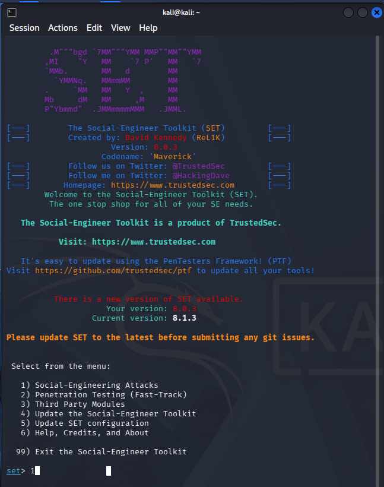
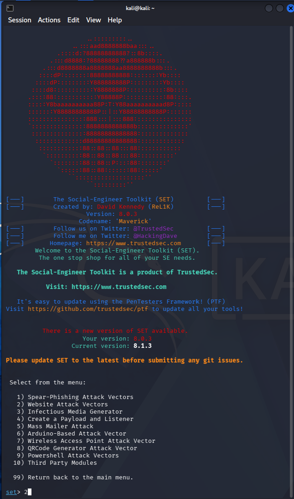
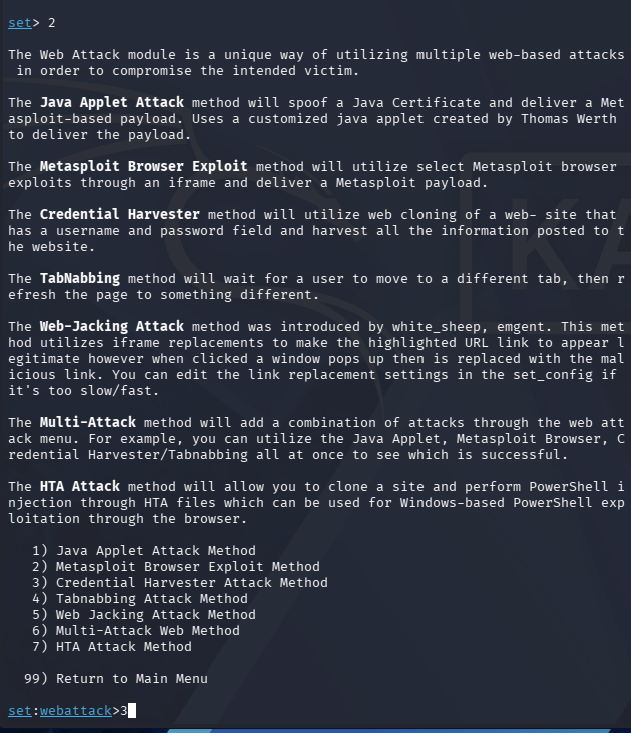
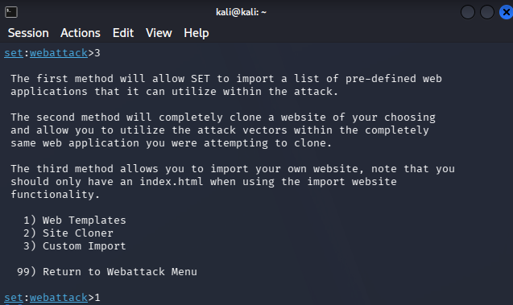
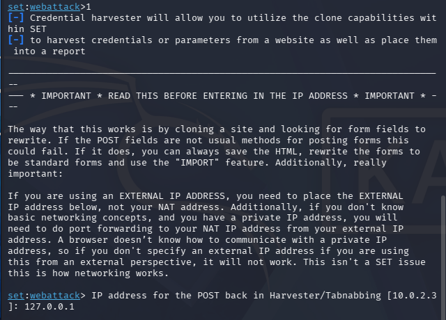
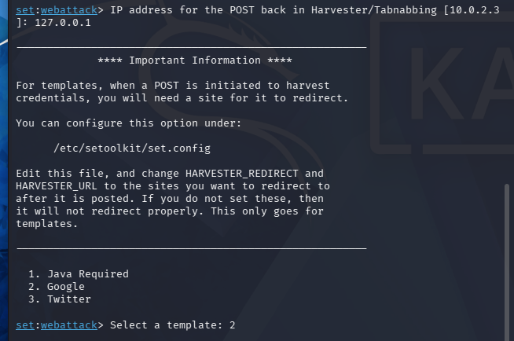
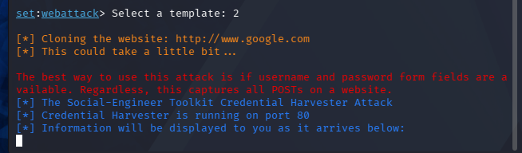
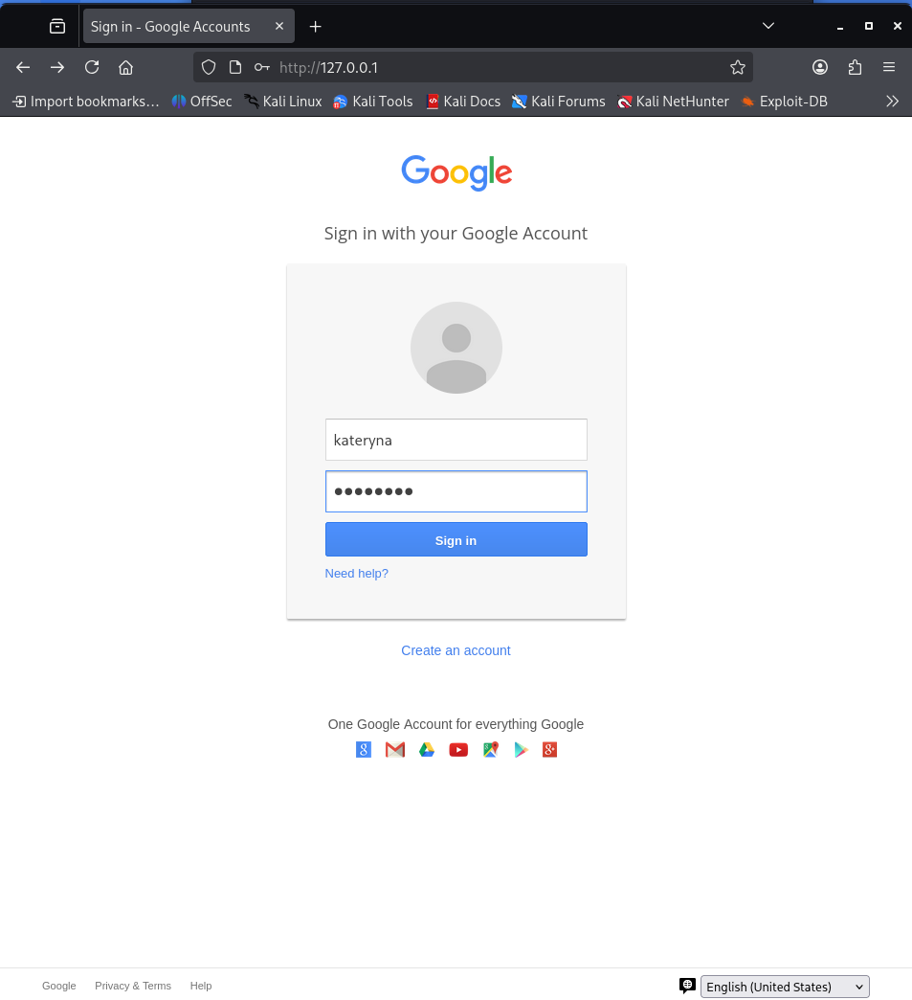
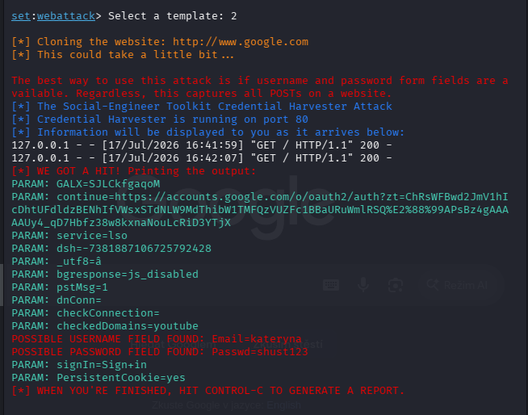
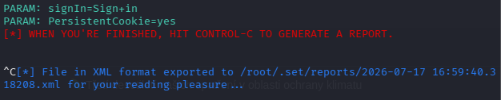

# Social Engineering Lab: Credential Harvester Attack with SET 

## Overview

This report documents a hands-on lab exercise from the **Social Engineering** module of a cybersecurity course. The goal was to reproduce a **Credential Harvester Attack** using the **Social-Engineer Toolkit (SET)** in a local virtual machine (Kali Linux) running on personal computer, demonstrating how an attacker can clone a legitimate login page (Google) to capture submitted credentials.

> ⚠️ **Disclaimer:** This exercise was performed strictly for educational purposes in an isolated, self-contained virtual machine (Kali Linux) on a personal computer, as part of a structured cybersecurity course (SoftServe Academy). The cloned page was only accessed locally by the author; no real credentials, real users, external networks, or production systems were targeted or exposed. This report is intended to demonstrate understanding of social engineering attack vectors for defensive and awareness purposes only.

## Objective

To understand and demonstrate how the **Credential Harvester Attack Method** works within SET — specifically how it clones a login form, rewrites POST parameters, and captures submitted data — in order to better recognize and defend against phishing techniques in real-world scenarios.

## Step-by-Step Walkthrough

### Step 1 — Launch SEToolkit
Verified SET was installed and launched the tool via the terminal.



### Step 2 — Select Social-Engineering Attacks
From the main menu, selected option `1) Social-Engineering Attacks`.



### Step 3 — Select Website Attack Vectors
Selected option `2) Website Attack Vectors`.



### Step 4 — Select Credential Harvester Attack Method
Selected option `3) Credential Harvester Attack Method`.



### Step 5 — Configure POST-back IP address
Entered the IP address to which captured form data (POST requests) would be sent — in this case the the local IP address of the Kali VM (or 127.0.0.1 for localhost testing).



### Step 6 — Select Web Templates
Selected option `1) Web Templates` to use a pre-built site template rather than cloning a custom URL.



### Step 7 — Select the Google template
Chose the built-in Google login template. SET generated a cloned phishing page hosted locally.



### Step 8 — Submit test credentials on the cloned page
Navigated to the generated page in the browser and submitted test (non-real) credentials to simulate a victim interaction.



### Step 9 — Captured credentials in the terminal
Returned to the SET terminal and observed the intercepted form fields:

```
POSSIBLE USERNAME FIELD FOUND: Email=kateryna
POSSIBLE PASSWORD FIELD FOUND: Passwd=shust123
```



### Step 10 — Generate report
Pressed `Ctrl+C` to stop the harvester and trigger SET's automatic report generation.



## Key Takeaway

This exercise illustrated how quickly a convincing credential-harvesting page can be deployed with minimal technical effort, reinforcing why user awareness (checking URLs, avoiding unsolicited login prompts, using MFA) remains one of the most effective defenses against phishing attacks — technical controls alone cannot fully prevent this class of attack.
